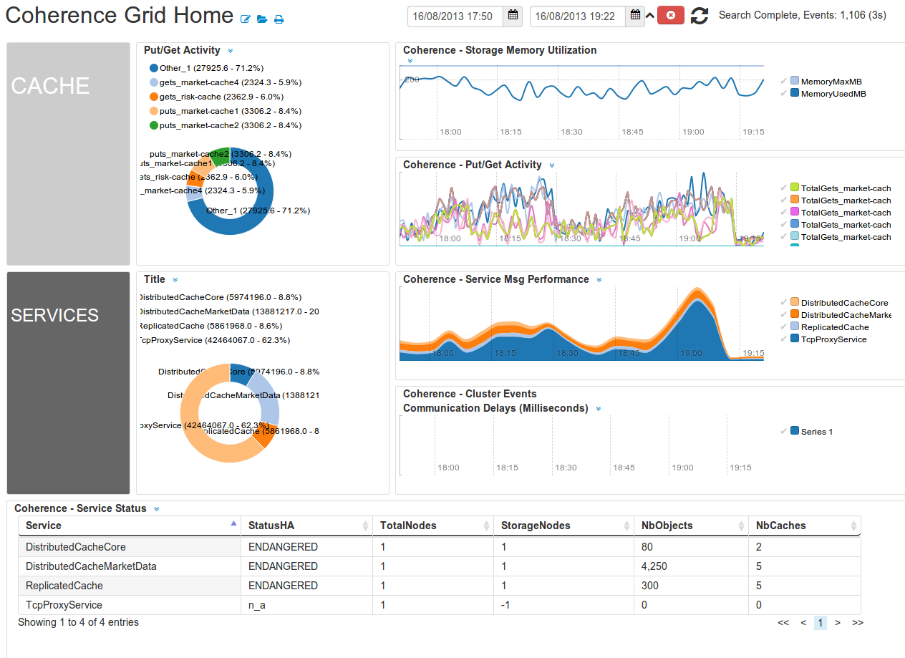

OracleCoherenceApp-1.0
===========

# Intro

Monitor hundreds of Coherence nodes using the CoherenceApp. The Coherence App will report on your clusters health, alert on potential problems and provide detailed charts on the performance of your caches and services. 

## Downloads 

 * [OracleCoherenceApp-1.0.zip](https://github.com/logscape/coherenceapp/raw/master/dist/OracleCoherenceApp-1.0.zip)
 * [OracleCoherenceApp-1.0-overrides.properties](https://github.com/logscape/coherenceapp/blob/master/OracleCoherenceApp-1.0-override.properties)

## QuickStart

        Please read how to setup Coherence before proceeding   [prerequisites](docs/prerequisites.md) 

1. Download the CoherenceApp and Overrides file.( CoherenceApp Download Page ). 
2. Configure your overrides for your Coherence Cache. Read [How to Setup Coherence Overrides](docs/overrides.md)
3. Configure your Datasources to point to your Coherence Log data. Read [Setting up the Datasources](docs/datasources.md) .

 

